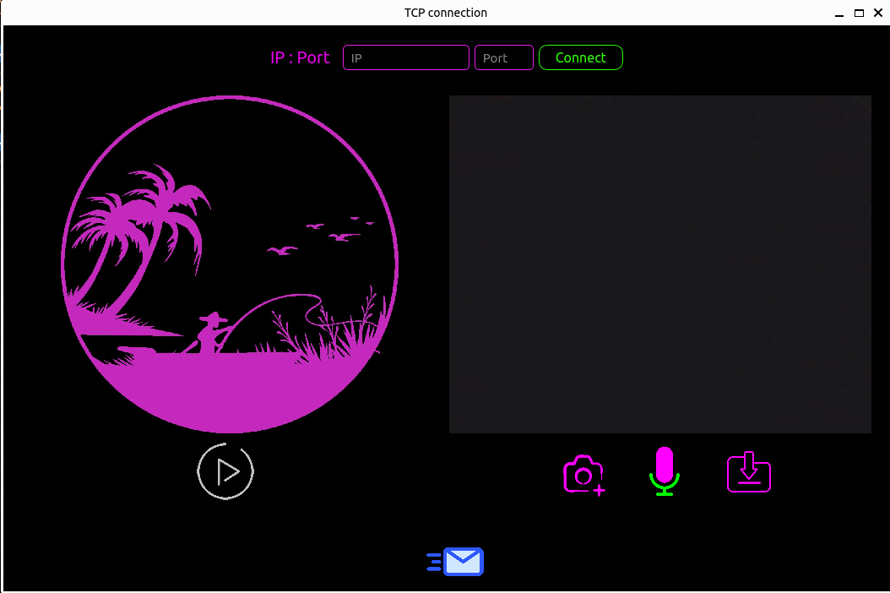

# TCP/IP Communication App

This repository contains a Python application for establishing TCP/IP communication between two laptops connected to the same Wi-Fi network. The application utilizes PySide6 for creating a graphical user interface (GUI) and facilitates the exchange of images captured from the webcam and recorded voice between the laptops.

## Features

- Establishes TCP/IP connection between two laptops on the same Wi-Fi network.
- Opens webcam and displays live feed in the GUI.
- Allows users to capture images from the webcam.
- Records voice using provided buttons in the GUI.
- Sends captured images and recorded voice to the second laptop.
- Second laptop receives and displays images, and provides a button to play received voice.

## Prerequisites

Ensure the following packages are installed:

- PySide6
- OpenCV
- pyaudio

## Usage

1. Clone the repository to your local machine:

    ```bash
    git clone https://github.com/MohammadMahdiNoroozi/TCP-Image-Voice-Transfer.git
    ```

2. Navigate to the cloned repository:

    ```bash
    cd your-repository
    ```

3. Run the application on both laptops:

    ```bash
    python main.py
    ```

4. Upon running the application, a socket server will start listening on `0.0.0.0` to receive data.

5. In the GUI of each laptop, enter the IP address and port of the other laptop to establish a connection.

6. Capture images from the webcam using the provided button.

7. Record voice using the buttons provided in the GUI.

8. Send the captured images and recorded voice to the second laptop.

9. The second laptop will receive and display the images, and provide a button to play the received voice.

## Example

Below is an example of the application in action:



## Notes

- Ensure both laptops are connected to the same Wi-Fi network.
- The application uses sockets for communication, hence ensure there are no firewall restrictions blocking the communication.
- Make sure to grant necessary permissions for webcam and microphone access.

